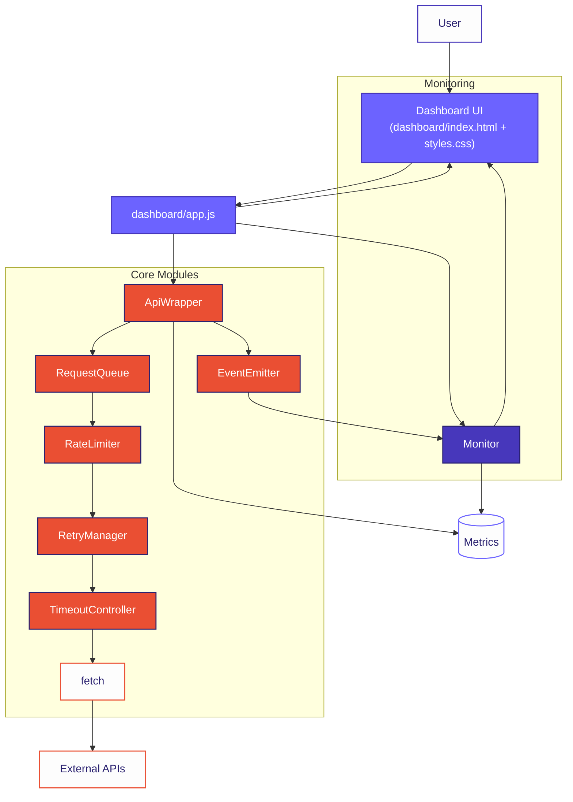

# Architecture

```mermaid
flowchart TD
  U[User] --> UI["Dashboard UI<br/>(dashboard/index.html + styles.css)"]
  UI --> APP["dashboard/app.js"]
  APP --> API[ApiWrapper]

  subgraph Core[Core Modules]
    API --> Q[RequestQueue]
    Q --> RL[RateLimiter]
    RL --> RM[RetryManager]
    RM --> TC[TimeoutController]
    TC --> F[fetch]
    API --> EE[EventEmitter]
  end

  subgraph Monitoring[Monitoring]
    M[Monitor] --> UI
    EE --> M
  end

  F --> EXT[External APIs]

  APP --> M
  APP --> UI

  API --> Metrics[(Metrics)]
  M --> Metrics

  class U user;
  class UI,APP dashboard;
  class API,Q,RL,RM,TC,EE core;
  class M monitor;
  class F,EXT external;
  class Metrics data;

  classDef user fill:#fdfdfd,stroke:#4737bb,color:#2a2170,stroke-width:1.5px;
  classDef dashboard fill:#6c63ff,stroke:#4737bb,color:#fdfdfd,stroke-width:1.5px;
  classDef core fill:#ea4f33,stroke:#2a2170,color:#fdfdfd,stroke-width:1.5px;
  classDef monitor fill:#4737bb,stroke:#2a2170,color:#fdfdfd,stroke-width:1.5px;
  classDef external fill:#fdfdfd,stroke:#ea4f33,color:#2a2170,stroke-width:1.5px;
  classDef data fill:#fdfdfd,stroke:#6c63ff,color:#2a2170,stroke-width:1.5px;
```
